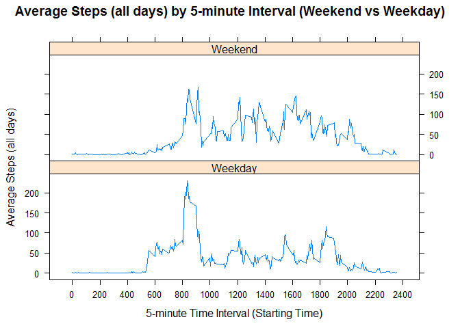

# Reproducible Research: Peer Assessment 1


## Loading and preprocessing data


```r
library(lattice)
data1 <- read.csv("./activity.csv", header = TRUE)
```

## What is the mean total number of steps taken per day?
For this part of the assignment, you can ignore the missing values in the dataset.

1.  Calculate the total number of steps taken per day

```r
data1T <- tapply(data1$steps, data1$date, FUN=sum)
data1T
```

```
## 2012-10-01 2012-10-02 2012-10-03 2012-10-04 2012-10-05 2012-10-06 
##         NA        126      11352      12116      13294      15420 
## 2012-10-07 2012-10-08 2012-10-09 2012-10-10 2012-10-11 2012-10-12 
##      11015         NA      12811       9900      10304      17382 
## 2012-10-13 2012-10-14 2012-10-15 2012-10-16 2012-10-17 2012-10-18 
##      12426      15098      10139      15084      13452      10056 
## 2012-10-19 2012-10-20 2012-10-21 2012-10-22 2012-10-23 2012-10-24 
##      11829      10395       8821      13460       8918       8355 
## 2012-10-25 2012-10-26 2012-10-27 2012-10-28 2012-10-29 2012-10-30 
##       2492       6778      10119      11458       5018       9819 
## 2012-10-31 2012-11-01 2012-11-02 2012-11-03 2012-11-04 2012-11-05 
##      15414         NA      10600      10571         NA      10439 
## 2012-11-06 2012-11-07 2012-11-08 2012-11-09 2012-11-10 2012-11-11 
##       8334      12883       3219         NA         NA      12608 
## 2012-11-12 2012-11-13 2012-11-14 2012-11-15 2012-11-16 2012-11-17 
##      10765       7336         NA         41       5441      14339 
## 2012-11-18 2012-11-19 2012-11-20 2012-11-21 2012-11-22 2012-11-23 
##      15110       8841       4472      12787      20427      21194 
## 2012-11-24 2012-11-25 2012-11-26 2012-11-27 2012-11-28 2012-11-29 
##      14478      11834      11162      13646      10183       7047 
## 2012-11-30 
##         NA
```

2.  Make a histogram of the total number of steps taken each day

```r
hist(data1T[complete.cases(data1T)],breaks=20,xlim=c(0,25000),
     xlab="Total Steps (per day)",
     main="Histogram of Total Steps per day (Oct & Nov 2012)")
```

<!-- -->

3.  Calculate and report the mean and median of the total number of steps taken per day

```r
#Mean total number of steps taken per day
mean(data1T,na.rm=TRUE)
```

```
## [1] 10766.19
```

```r
#Median total number of steps taken per day
median(data1T,na.rm=TRUE)
```

```
## [1] 10765
```

## What is the average daily activity pattern?

1.  Make a time series plot (i.e. type = "l") of the 5-minute interval (x-axis) and the average number of steps taken, averaged across all days (y-axis)

```r
data1D <- tapply(data1$steps, data1$interval, FUN=mean, na.rm=TRUE)
plot(names(data1D),data1D,type="l",xaxp=c(0, 2400, 6),
     ylab="Average Steps (all days)",
     xlab="5-minute Time Interval (Starting Time)",
     main="Average Steps (all days) by 5-minute Time Interval (Oct & Nov 2012)")
```

<!-- -->

2.  Which 5-minute interval, on average across all the days in the dataset, contains the maximum number of steps?

```r
names(data1D[order(data1D,decreasing=T)[1]])
```

```
## [1] "835"
```

## Imputing missing values
Note that there are a number of days/intervals where there are missing values (coded as NA). The presence of missing days may introduce bias into some calculations or summaries of the data.

1.  Calculate and report the total number of missing values in the dataset (i.e. the total number of rows with NAs)

```r
sum(is.na(data1))
```

```
## [1] 2304
```

2.  Devise a strategy for filling in all of the missing values in the dataset. The strategy does not need to be sophisticated. For example, you could use the mean/median for that day, or the mean for that 5-minute interval, etc.

**The NA values in the original dataset data1 will be replaced with the averages steps by 5-minute time interval across all the days in the dataset and saved to dataset data2.**

3.  Create a new dataset that is equal to the original dataset but with the missing data filled in.


```r
data2 <- data1
NAS <- is.na(data2$steps)
data2$steps[NAS] <- data1D[as.character(data2$interval[NAS])]
```

4.  Make a histogram of the total number of steps taken each day and Calculate and report the mean and median total number of steps taken per day. Do these values differ from the estimates from the first part of the assignment? What is the impact of imputing missing data on the estimates of the total daily number of steps?

```r
data2T <- tapply(data2$steps, data2$date, FUN=sum)
hist(data2T,breaks=20,xlim=c(0,25000),ylim=c(0,20),
     xlab="Total Steps (per day)",
     main="Histogram of Total Steps per day (Oct & Nov 2012)")
```

<!-- -->

```r
#Mean total number of steps taken per day
mean(data2T,na.rm=TRUE)
```

```
## [1] 10766.19
```

```r
#Medial total number of steps taken per day
median(data2T,na.rm=TRUE)
```

```
## [1] 10766.19
```
**The mean has stayed the same from the first part of the assignment. Meanwhile, the median has changed and is now equal to the mean. The impact of imputing missing data by assuming it matches the mean has had the impact of increasing the frequency of days at the mean total number of steps. To be precise, the frequency has increased by eight at the mean, equivalent to the number of NA days in the original dataset.**

## Are there differences in activity patterns between weekdays and weekends?

For this part the weekdays() function may be of some help here. Use the dataset with the filled-in missing values for this part.

1.  Create a new factor variable in the dataset with two levels - "weekday" and "weekend" indicating whether a given date is a weekday or weekend day.

```r
data2$wf <- factor(ifelse(weekdays(as.Date(as.character(data2$date), "%Y-%m-%d")) %in% c('Sunday','Saturday'),"Weekend","Weekday"))
```

2.  Make a panel plot containing a time series plot (i.e. type = "l") of the 5-minute interval (x-axis) and the average number of steps taken, averaged across all weekday days or weekend days (y-axis). See the README file in the GitHub repository to see an example of what this plot should look like using simulated data.


```r
#Split dataset by weekday/weekend and calculate daily averages
data2wd <- data2[data2$wf=="Weekday",]
data2we <- data2[data2$wf=="Weekend",]
data2wdT <- aggregate(data2wd$steps, list(data2wd$interval), FUN=mean, na.rm=TRUE)
data2weT <- aggregate(data2we$steps, list(data2we$interval), FUN=mean, na.rm=TRUE)
colnames(data2wdT) <- c("interval","steps")
colnames(data2weT) <- c("interval","steps")
data2wdT$wf <- "Weekday"
data2weT$wf <- "Weekend"

#Combine daily averages into one dataset
data2D <- rbind(data2wdT,data2weT)

xyplot(steps~interval|wf,data2D,layout=c(1,2),type="l",
       scales=list(y=list(tick.number = 7),x=list(tick.number = 13)),
       ylab="Average Steps (all days)",
       xlab="5-minute Time Interval (Starting Time)",
       main="Average Steps (all days) by 5-minute Time Interval (Weekend vs Weekday)")
```

<!-- -->

